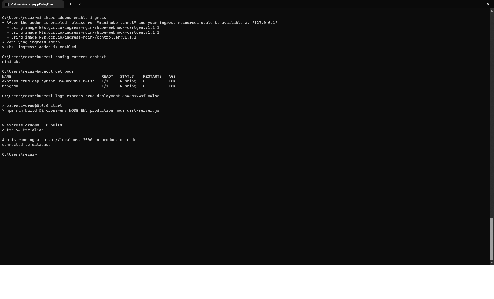
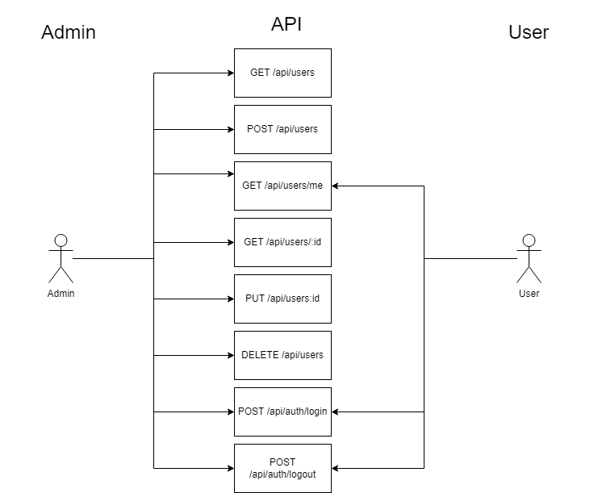

EXPRESS CRUD

This is a simple showcase of how express works with typescript

Kubernetes config is included in k8s directory



modify your mongo path in /assets/development.json then

seed database with

```bash
npm run seed
```

admin credential is email: 'user1@gmail.com', password: 'user1@gmail.com!'

API documentation with swagger can be seen in route /api/api-doc

Diagram of API with role

